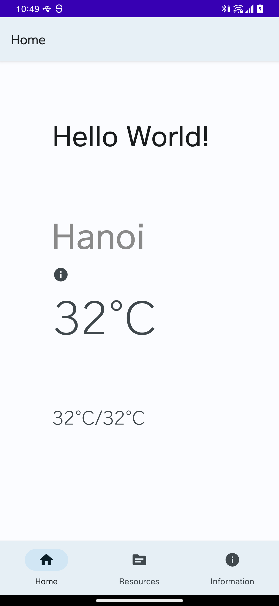
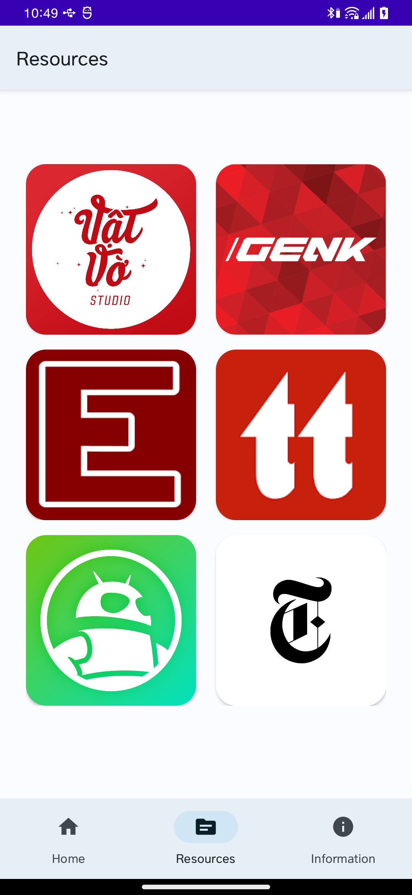
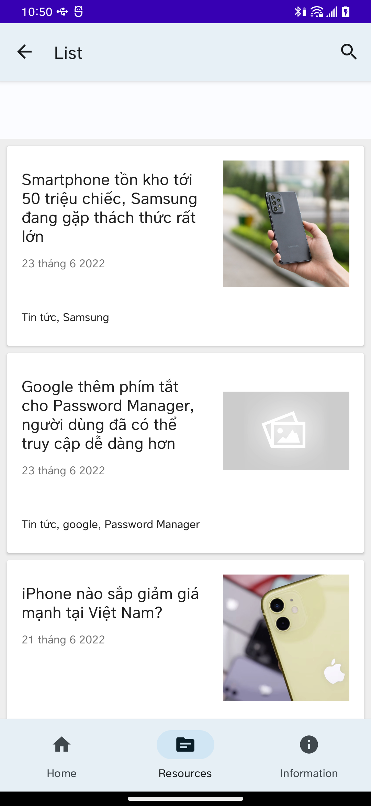
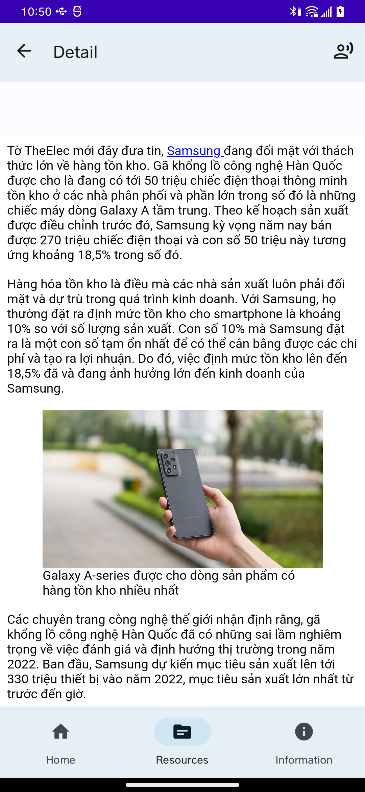
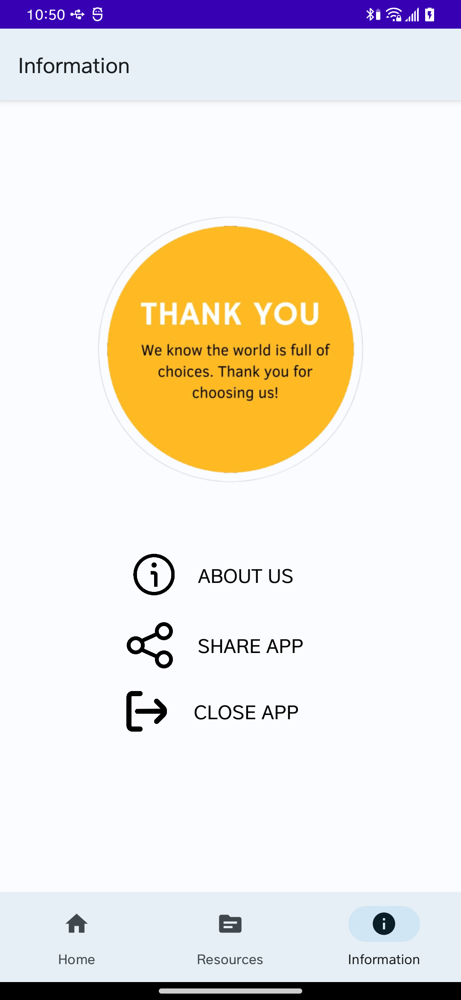

<div align="center">
    
</div>

<br>
<br>
<br>

<div align="center">
    
    
    
</div>

<div align="center">
    <h1>BaoOfficial</h1>
    <p>This is a "NOOB" copy of  <a href="https://reederapp.com/">Reeder</a>, in order to give Android an RSS reader.</p>
    <br/>
    <br/>
    
    
    
    
    
    <br/>
    <br/>
</div>

## Features

**BaoOfficial** is my first project so it has no special features


## Build

> If you want to preview the Read You app, you can get the **preview version** of the APK file in [Telegram](https://t.me/ReadYouApp).

**Read You** is implemented on Android's native [Jetpack Compose](https://developer.android.com/jetpack/compose) architecture.

1. First you need to get the source code of **Read You**.

    ```shell
    git clone https://github.com/quytttb/BaoOfficial.git
    ```

2. Then open it via [Android Studio (latest version)](https://developer.android.com/studio).

3. When you click the `▶ Run` button, it will be built and run automatically.

    > In case of lag, please select Release version build.

## Credits

-   [ParseRSS](https://github.com/muhrifqii/ParseRSS): [MIT](https://github.com/muhrifqii/ParseRSS/blob/master/LICENSE)

## License

None
